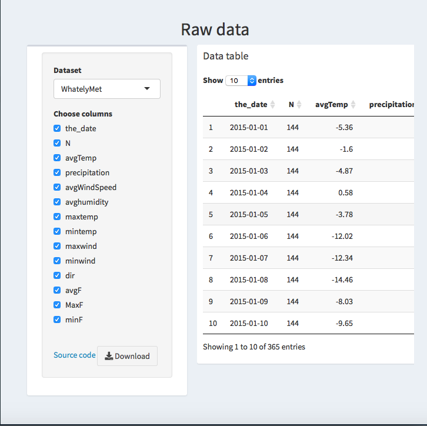

# Introduction
   The Center for the Environment, Ecological Design, and Sustainability (CEEDS)  is located in Wright Hall building of Smith College. The goal of Ceeds is to train and allow students to consider sustainability issues across various disciplinary areas to integrate that multi-disciplinary knowledge in support of environmental decisions and action. Macleish Field Station is one of the many opportunities Ceeds provides to the Smith community to pursue environmental research, outdoor recreation, and low impact recreation. 
  
   The MacLeish Field Station is located in a 260 acre of forest farmland near Whately, Massachusetts, and its weather collection sites are at the end of Poplar Hill Road. There are two weather site locations in the field, one called WhatelyMet Tower and the other one called OrchardMet. The WhatelyMet tower is mounted at the top of a 25.3m tall tower, and it is 250.8m above sea level. It was initially created to collect air pollution data. In order to collect more efficient weather data, OrchardMet weather station was created. The OrchardMet weather station is 10m tall located in a forest clean area close to ground level. However, the trees do not allow OrchardMet weather station to collect data efficiently as hoped. 
 
   As part of the SDS 410 Capstone class, our group of 3 were given Macleish weather data from the Macleish package that is collected through the Smith server. There is a current Macleish weather dashboard that collects a variety of weather data: date, wind speed, temperature, wind direction, real humidity, pressure, solar radiation, and rainfall.  The server has been collecting data since January 2012, and it is updated every 10 minute increments. Thus, there is over 377,016 entries. The data loggers run on solar power and stores the data so even if the server is down the data is saved. The current MacLeish weather dashboard^[current Macleish weather dashboard: http://macleish.smith.edu/index.html] contains a lot of useful information, and the data is organized into readable tabs. Because the data is trapped in individual “data silos”, it is not readily accessible. Therefore, the goal for the given project is to recreate the current Macleish weather dashboard to illuminate the data and make it more user friendly, it download accessible, and it visually interactive as proposed by our client, Paul Wetzel. Our client Paul Wetzel is the field station manager of MacLeish Field Station, and he is the main user of the current website. As discussed and mentioned earlier about our clients needs, we chose to make the new weather dashboard using the Shiny package. We choose to use Shiny, since it would allow us to make the download data opportunity catered to the audience’s needs, and it would help us make the graphs interactive and user friendly. We believe our focus would supply to the current target audiences, Paul Wetzel, other Smith students, Smith faculty/researchers, and Northampton Department of Public Works. 
 
 {width=350px}^[Fig 1. Example of a what the current dashboard looks like]
 

# Methods

##Shiny app:
   To solve our problem, we had many options on how to create a better way of displaying the weather data. We first discussed the possibility of making a new website in HTML but we ultimately decided to build a Shiny App using the Shiny^[Winston Chang, Joe Cheng, JJ Allaire, Yihui Xie and Jonathan McPherson (2018).
  shiny: Web Application Framework for R. R package version 1.2.0.
  https://CRAN.R-project.org/package=shiny] and Shiny Dashboard^[Winston Chang and Barbara Borges Ribeiro (2018). shinydashboard: Create Dashboards
  with 'Shiny'. R package version 0.7.1.
  https://CRAN.R-project.org/package=shinydashboard] packages in R. Shiny is a package that allows us “to build interactive web applications (apps) straight from R.”  Shiny allows the user to be able better communicate data with  interactive charts, visualizations, text and tables. We then decided to use Shiny Dashboard which is a package that allows us to create an interactive dashboard using Shiny. Because our problem was to find a way to display interactive data visualizations, the Shiny package seemed to be the better option because that is what it was built to do. Shiny also allows us to make normally static plots like ggplots interactive and take in user input so we don’t need to use HTML widgets. 
  
  Shiny is based on a reactive programming model which means that it takes in input given by the user of the app and acts accordingly.  Shiny apps have two components: the user interface (UI) and the server.  You can think of the UI as what the user of your app will see when they open your app. The UI component converts your code in R and generates it into a web document in HTML. UI contains the instruction about what you want the user to see and the layout of your app.  our UI  is where we define the dashboard page. And inside this dashboard page we define our elements like the sidebar menu, tabs, the dashboard body (Tab items, boxes, text).  The server is the R code that tells your shiny server what to do when the user does certain things in the app. The server is a function where we define the output and tell the host of our app what to do with the user input. Server function  is where we render the charts, visualizations, and tables.  We then knit together the Server function and UI using the ShinyApp (UI, server) function in the Shiny package. 

  So we built a Shiny dashboard. Our dashboard has a sidebar menu that has four tab items. 
One tab item we built  was the current weather tab. The current weather tab gives the user the the current 10 minute weather for WhatelyMet and OrchardMet. Because we wanted to have our data be shown as a text object and not a table, our code for this tab was largely done using HTML. We used a bit of HTML to change the sizing of the text and the alignment of the rows. To make the teal boxes, we used the shinydashboard Plus package^[David Granjon (2019). shinydashboardPlus: Add More 'AdminLTE2' Components to
  'shinydashboard'. R package version 0.7.0.
  https://CRAN.R-project.org/package=shinydashboardPlus], allowed us to make a clear, concise first page of our Shiny app. Another tab on our dashboard is the about tab where we explain our project and give information about the weather stations. 

{width=350px}
^[Fig 2. Example of a what our sidebar menu and dashboard looks like]

Another tab that we built was the historic data tab. We made a way for the user to switch between daily data for OrchardMet and WhatelyMet in the historic data tab, this means the graphs shown are reactive and are  based on the data set that was selected by the user. We did by making a reactive function inside the server that allows people to switch between data sets, this function we call datasetInput. We made graphs mapping 3 (Wind speed, precipitation, temperature) variables over time. To do build these graphs we used the highcharter package^[A Wrapper for the 'Highcharts' Library. R package
  version 0.7.0. https://CRAN.R-project.org/package=highcharter] that allows the user to filter the data based on a certain time period and high charter also has a feature that enables users to download the data used to make the graphic. 
{width=350px}
^[Fig 3. Example of a Highcharter graph that shows temperature ]

  We also made a visualization where the user can make a custom correlation graph by picking the variables that they want. We made this correlation scatterplot by using ggplot and ggplotly to make the graphic more interactive.  We also made a windrose graph to show wind speed and direction using ggplot. A wind rose is a polar chart which  shows the user how wind speed and wind direction are distributed at a over a specific period of time.  We also created a way to allow the  user to choose a variable  and get summary statistics on that variable.  In this tab, we made the graphs be in a fluid page, this allows for the size of the boxes and visuals to change based on the size of the window. We then put all of our content for the tab in separate boxes that are collapsible. We did this to minimize users' scrolling. 
{width=350px}
^[Fig 4. Example of a Windrose graph]

  The last tab we made is the raw data tab. This tab allows the user to filter the data based on columns  and the user can also choose between daily data for OrchardMet and WhatelyMet. This tab also allows the user to search the data table using the DT package. 
  
{width=350px}
^[Fig 5. A screenshot of our raw data tab]

##Ceeds package:
   The data from the two weather stations is currently being saved on the Macleish Server hosted at Smith college.  We used the Macleish package^[Benjamin S. Baumer, Rose Goueth, Wencong Li, Weijia Zhang and Nicholas Horton
  (2018). macleish: Retrieve Data from MacLeish Field Station. R package version
  0.3.2. https://CRAN.R-project.org/package=macleish] to fetch the two data  tables from the server. However this involved a lot of  code that would have to be repeated  anytime we wanted to run the app. So we decided to write an R package called "ceeds" to more efficiently do these tasks.  This package was also built Help other students to work on the MacLeish weather data. We wrote a  function that uses the Macleish package and fetches 2 data sets (Whately, Orchard) that is updated every ten minutes. We also created a function,get_daily(), inside the package that takes a data set and  gives the user the data grouped by date. Our data from the server comes in 10 minute increments but we might want to group by date. So we used the Lubridate package^[Garrett Grolemund, Hadley Wickham (2011). Dates and Times Made Easy with lubridate.
  Journal of Statistical Software, 40(3), 1-25. URL
  http://www.jstatsoft.org/v40/i03/.] that was very helpful. It allowed us to Parsed timestamps into dates (turning variables into dates that r can recognize as such). This allowed us to group  our data by date.  

# References {#references .unnumbered}
Our Github Repository: https://github.com/beanumber/ceeds

## Packages:
lubridate: Garrett Grolemund, Hadley Wickham (2011). Dates and Times Made Easy with lubridate.
  Journal of Statistical Software, 40(3), 1-25. URL
  http://www.jstatsoft.org/v40/i03/.

highcharter: Joshua Kunst (2019). highcharter: A Wrapper for the 'Highcharts' Library. R package
  version 0.7.0. https://CRAN.R-project.org/package=highcharter
 
   

macleish: Benjamin S. Baumer, Rose Goueth, Wencong Li, Weijia Zhang and Nicholas Horton
  (2018). macleish: Retrieve Data from MacLeish Field Station. R package version
  0.3.2. https://CRAN.R-project.org/package=macleish
  

shiny: Winston Chang, Joe Cheng, JJ Allaire, Yihui Xie and Jonathan McPherson (2018).
  shiny: Web Application Framework for R. R package version 1.2.0.
  https://CRAN.R-project.org/package=shiny

  
shinydashboard: Winston Chang and Barbara Borges Ribeiro (2018). shinydashboard: Create Dashboards
  with 'Shiny'. R package version 0.7.1.
  https://CRAN.R-project.org/package=shinydashboard

shinydashboardPlus: David Granjon (2019). shinydashboardPlus: Add More 'AdminLTE2' Components to
  'shinydashboard'. R package version 0.7.0.
  https://CRAN.R-project.org/package=shinydashboardPlus

